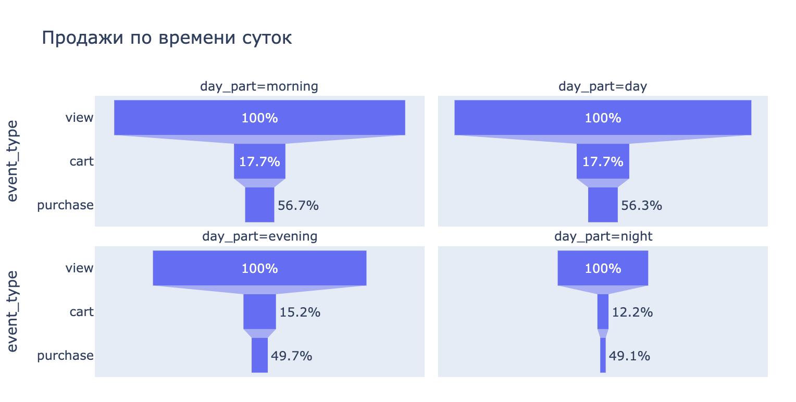
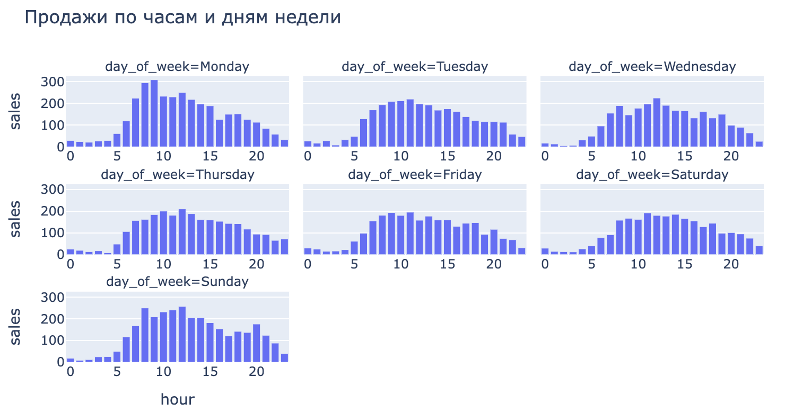
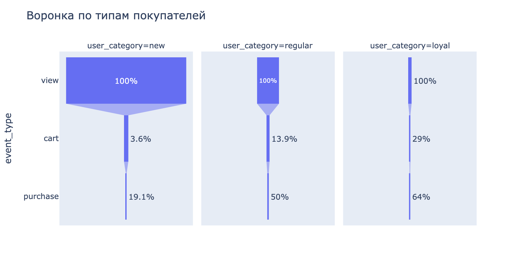

# E-commerce Funnel & Product Analytics

Анализ данных интернет-магазина электроники за март: воронка конверсии, ключевые метрики и продуктовые гипотезы.

## О проекте

Исследование пользовательского поведения на основе событийных данных (`view`, `cart`, `purchase`) с целью выявить проблемные места в продукте и предложить data-driven гипотезы для роста конверсии и выручки.

**Что было сделано:**
- Построена и визуализирована воронка конверсии с разбивкой по времени суток и типам пользователей
- Рассчитаны ключевые продуктовые метрики (AOV, AIV, time-to-purchase, % брошенных корзин)
- Выявлены 3 проблемных места в продукте с подтверждением данными
- Сформулированы 5 продуктовых гипотез в формате «что делаем → результат → почему сработает»

## Ключевые находки

### Воронка

| Шаг | События | Конверсия |
|-----|---------|-----------|
| View | 972 713 | 100% |
| Cart | 55 911 | 5.7% |
| Purchase | 19 951 | 35.7% (от cart) |

**Итоговая конверсия view → purchase: ~2%.** Главное узкое место — переход view → cart, где теряется 94.3% пользователей. Утром конверсия cart→purchase значительно выше (56.7%), чем ночью (49.1%).

### Метрики

| Метрика | Значение |
|---------|----------|
| Пиковое время продаж | Понедельник, 9–11 МСК |
| Брошенные корзины | 64% |
| Time to purchase | 7 мин 55 сек |
| AOV (средний чек) | $391 |
| AIV (средний товар) | $326 |

AOV ≈ AIV — в среднем покупают ~1.2 товара за сессию, потенциал кросс-селла практически не реализован.

### Проблемы

1. **Низкая конверсия view → purchase (2%)** — 64% корзин брошены, CAC уже оплачен
2. **95% каталога — «мёртвые» товары** — только 5% SKU имеют хотя бы одну продажу
3. **Концентрация продаж в узком временном окне** — пик в понедельник утром, вечера и выходные недозагружены

### Гипотезы

1. **Напоминание о брошенной корзине** — push/email через 30–60 мин → cart→purchase с 35.7% до 45–50%
2. **ML-прогноз продаж до листинга** — модель предсказывает спрос до публикации → мёртвые товары с 95% до 80–85%
3. **Автоскидки на залежалые товары** — скидка 10–15% через 14 дней без продаж → SKU с продажами с 5% до 8–10%
4. **Flash-акции в низкоактивные слоты** — промо в пятницу вечером/выходные → продажи off-peak +20–30%
5. **Персональные рекомендации на основе ML** — collaborative filtering + content-based → view→cart с 5.7% до 8–10%, AOV +15–20%

## Визуализации

<details>
<summary>Воронка по времени суток</summary>



</details>

<details>
<summary>Продажи по часам и дням недели</summary>



</details>

<details>
<summary>Воронка по типам пользователей</summary>



</details>


## Стек

| | |
|---|---|
| **Язык** | Python 3 |
| **Данные** | pandas, numpy |
| **Визуализация** | Plotly Express, Plotly Graph Objects |
| **Среда** | Jupyter Notebook |

## Структура

```
├── README.md
├── main.ipynb          # основной ноутбук с анализом
├── data/
│   └── event_data.csv  # исходные данные (view/cart/purchase)
└── images/             # скриншоты графиков
```

## Как запустить

```bash
git clone https://github.com/<username>/ecommerce-funnel-analytics.git
cd ecommerce-funnel-analytics
pip install pandas numpy plotly
jupyter notebook main.ipynb
```
